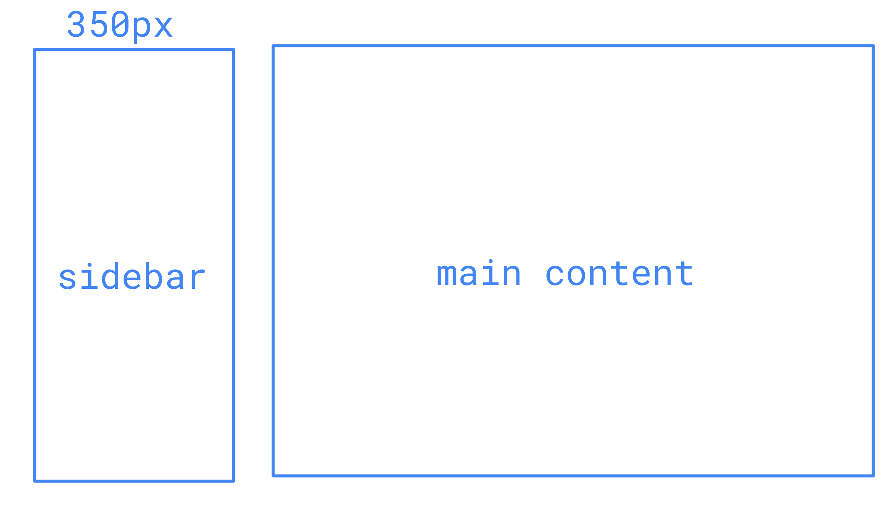
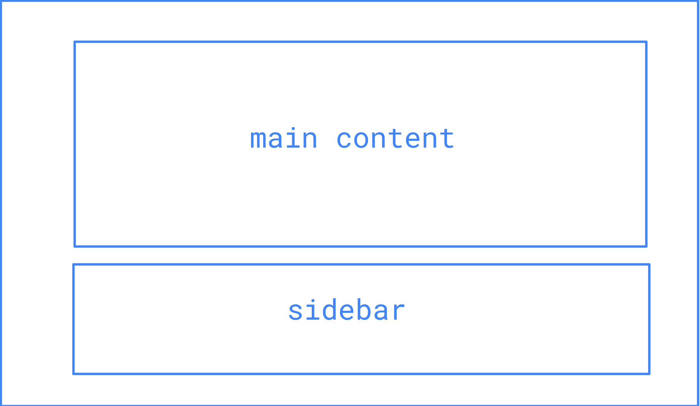
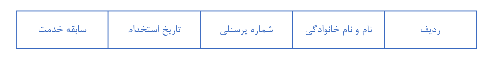

# React JavaScript Test

A sample project with React to test your familiarities with this library as well as Html, CSS and JavaScript.

### Requirements

You need [Node.js](https://nodejs.org/en/download) installed on you machine to run the Node server and the **React** project.

### Included in the Box

You will find a simple Node server in `./backend_server` folder that provides the necessary API endpoints. Additionally, a boilerplate React project is placed in `./react_project` with the necessary libraries included. Use this folder as the starting point for completing the tasks described in the next steps.

## Step 1: Preparation

In our project, **React Router** is already included. Configure the React Router to have these 4 routes:

- /
- /layout
- /table
- /searchbar

> **Note:** Make use of Data API in the new versions of React Router

## Step 2: Layout

Now that the setup is complete, we want to implement this typical sketch found in many web application user interfaces:

It is however important that the page is responsive, so if the page is resized and the width of `main content` has reached `500px` or less, the page should take this form:

## Step 3: Cool Table!

Under the `/table` route, create a table with these columns

and fill it with random data. To make the table cool, add **sort** functionality to each column, i.e, by clicking on each column header, the table should be sorted ascending or descending based on that column.

## Step 4: Searchbar

At this point, we will need our simple backend server, so make sure the Node server in `./backend_server` is up and running. This web server provides two API endpoint:

1. The first API endpoint is accessible on `GET: http://localhost:3000/?q=[search query]` which returns a list of countries containing the search query. Example: `http://localhost:3000/?q=ira` returns list of all countries that include `ira` in their names.
2. The second API endpoint is accessible on `GET: http://localhost:3000/chart/[country code]` which returns the instantaneous fictional currency value of the given country code. Example: `http://localhost:3000/chart/IR` returns a single time point data where the `x` value is time in `HHMM` format and `y` is a fictional currency value.

Now in the first part, the goal is to create a searchbar where the user can type and see the results in real-time. Create an input and style it to your liking and come up with an elegant way to show the results interactively as the user types a search query in the input. Here, there is no specific design guideline, so make the styling the way you find personally pleasing.  It is also necessary to utilize **React Query** for data fetching.

> **Note:** Reducing and optimizing the number of queries to the server is a definitely a plus

> **Hint:** Focus more on the UX than the UI

In the next part, we want to go one step further and add an interactive chart using [Chartjs](https://www.chartjs.org/) to show the fictional currency values of the selected country.

First make sure this library in installed, then, create the functionality to fetch the currency value data when the user clicks on one of the search results. The currency value data is a time series that is updated every time you call the API and it should be plotted as a line chart. Make sure to call the API for currency data every second to get an updated time series and update the data in the chart accordingly.

## Step 5: CI/CD?

Yes! First, create a unit test for the first part of the **Step 4** and assert the correct rendering of search results when a user input is given. Then, dockerize your backend server and your React web application to run in a production environment.
